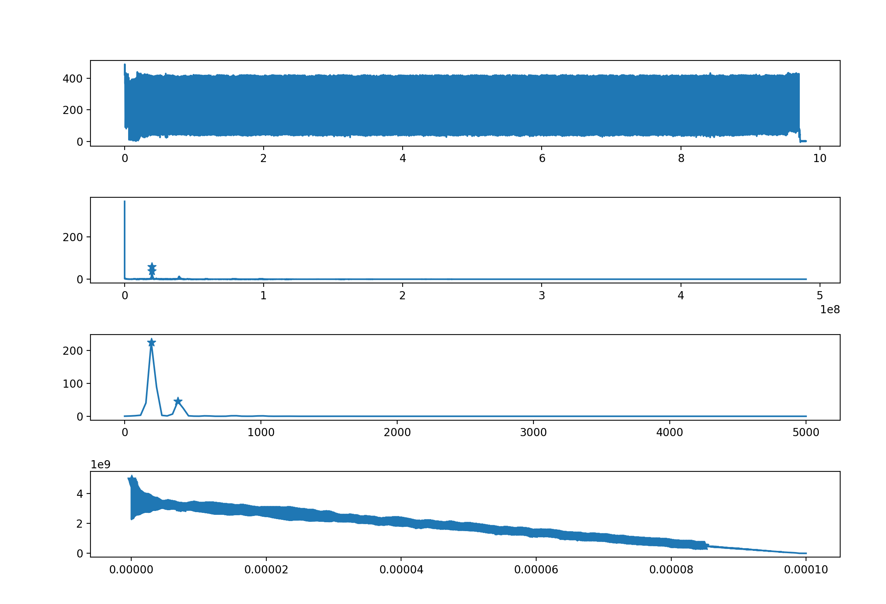
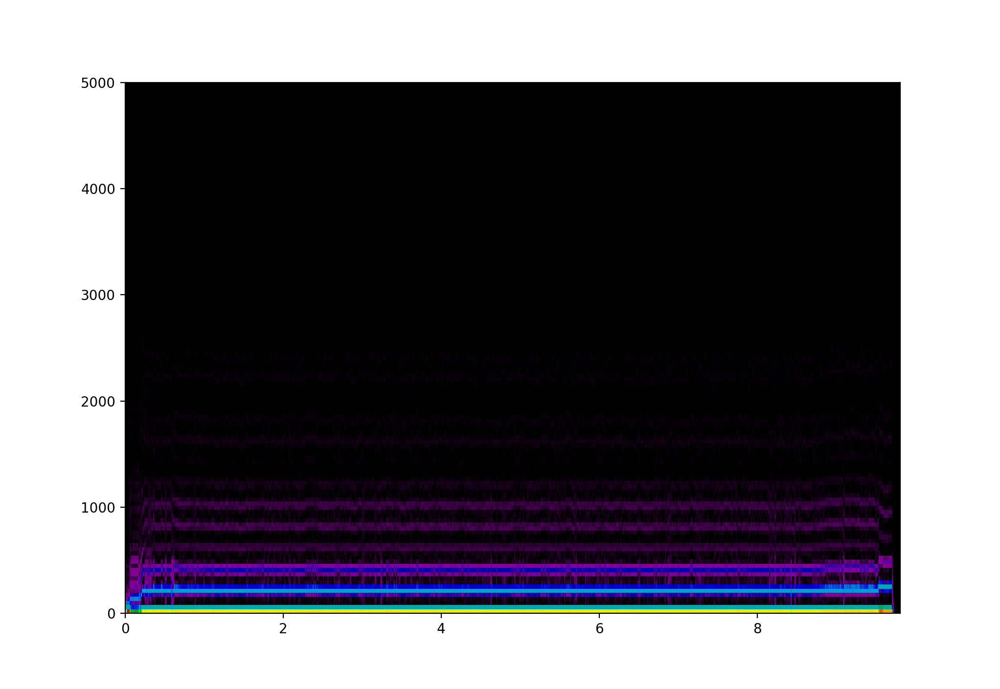
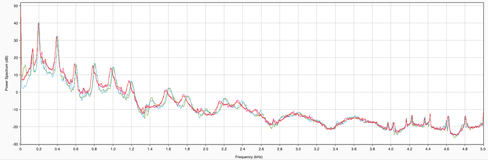

## 성학's workspace

- project management를 위한 github organization 세팅

- 19.11.05
    - 신호처리를 위한 DFT/FFT/STFT 리서치
    - Fourier 시리즈와 변환에 대한 이해
    - matlab 활용한 ploting

- 19.11.06
    - matlab 활용한 data 읽고 쓰기(mat 파일)
    - sprintf(), evl(), 함수 활용
    - FFT/PSD/Correlation 파이썬 코딩

- 19.11.07
    - STFT 파이썬 코딩
    - github 추가세팅
    - 윈도우 사이즈 조절 STFT 확인

- 19.11.08
    - 잠정적 불량신호(data0573, data0574) 확인
    - matlab filterdesigner 활용 필터링 시도
